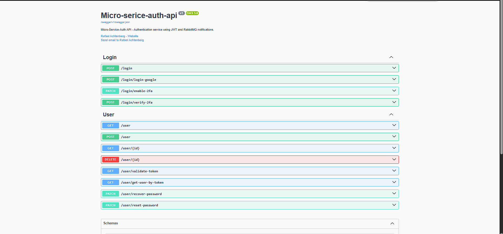

## Micro-Service-Auth

O Micro-Service-Auth é um sistema baseado em microserviços, desenvolvido em .NET, que realiza a autenticação de usuários utilizando JSON Web Token (JWT) e envia notificações por e-mail via RabbitMQ. O projeto usa Docker para facilitar o deploy e MySQL como banco de dados relacional. Este sistema é projetado para ser altamente escalável e modular, com cada serviço operando de maneira independente.

## Arquitetura

A arquitetura do sistema é baseada em microserviços independentes que se comunicam entre si por meio de mensagens RabbitMQ. Cada serviço é contêinerizado usando Docker, o que permite escalabilidade e facilita o deploy. A arquitetura inclui os seguintes componentes:

Serviço de Autenticação: Responsável pela autenticação dos usuários utilizando JWT.

Serviço de Notificação: Envia e-mails para os usuários, utilizando RabbitMQ para receber as mensagens.

Banco de Dados: Utiliza MySQL para armazenar os dados dos usuários e outras informações relevantes do sistema.

## 🛠️ Tecnologias Utilizadas

- [.NET](https://dotnet.microsoft.com/pt-br/)
- [ASP.NET](https://learn.microsoft.com/pt-br/aspnet/core/?view=aspnetcore-9.0&WT.mc_id=dotnet-35129-website)
- [JWT](https://jwt.io/)
- [RabbitMQ](https://www.rabbitmq.com/)
- [SqlServer](https://www.microsoft.com/pt-br/sql-server/sql-server-downloads)

## Documentação

Api Documentada via OpenApi.

🔋 **Controle de versão e deploy**

- [Git](https://git-scm.com)
- [Docker](https://www.docker.com/)

⚙️ **Como Rodar o Projeto**

Para rodar o projeto em seu ambiente local, siga os passos abaixo:

1.  Clonar o Repositório
    Primeiramente, clone o repositório do GitHub para sua máquina local:

    $ git clone https://github.com/Faelkk/micro-service-auth.git

2.  Instalar as Dependências
    Acesse o diretório do projeto e instale as dependências:

        $ dotnet restore

3.  Configurar o Docker Compose
    Antes de rodar o projeto, configure as variáveis do docker-compose de acordo com as suas necessidades. Certifique-se de que o Docker e o Docker Compose estão instalados corretamente em sua máquina.

4.  Construir o Projeto com Docker
    Crie as imagens do Docker para o projeto:

        $ docker compose build

5.  Subir o Projeto
    Finalmente, suba o projeto utilizando Docker Compose:

        $ docker compose up -d

 

**Como me ajudar nesse projeto?**

- Você ira me ajudar muito me seguindo aqui no GitHub
- Dando uma estrela no projeto
- Conectando-se comigo no LinkedIn para fazer parte da minha rede.

 

**Feito por**
[Rafael Achtenberg](linkedin.com/in/rafael-achtenberg-7a4b12284/)
